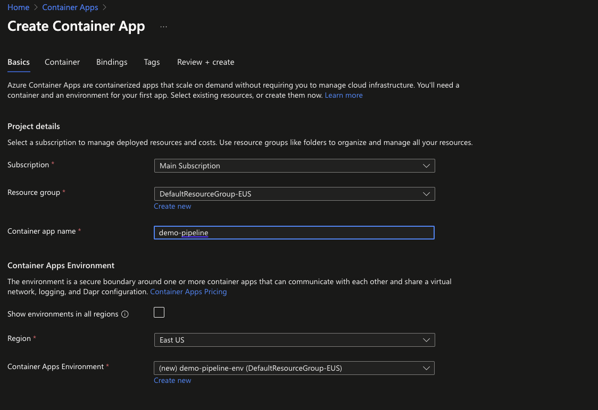
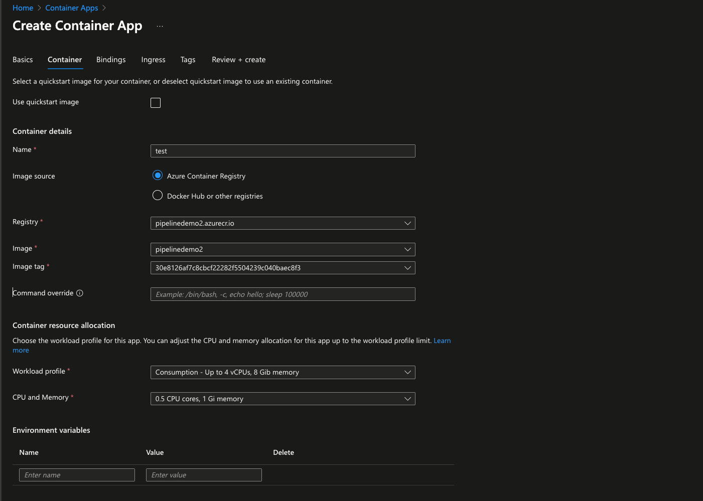

### Introduction

This is example of CI/CD pipeline setup for backend and frontend solution for Azure Container Registry service

### Getting started

#### Requirements

- Basic knowledge of Azure
- Basic knowledge of Github

#### Problem

We have source code in one of our repositories, we need to deploy source code for deployment, pre-release and release scenarios.

#### Solution overviews

- Create necessary branches
- Create cloud resources
- Setup workflows

### Creating necessary branches


These branches must be created 

- main
- release/** - created only when releasing
- staging
- dev

### Create cloud resources

In this example we will create resources in azure cloud 


#### Create service principal

- Create Service Principal ( registered application ) with following command and copy result credentials in json. Those credentials will be used by github actions

```Bash
az ad sp create-for-rbac --name github-actions-app --role contributor --scopes /subscriptions/<subscription-id>/resourceGroups/<rg-name> --json-auth --output json
```

Update `<subscription-id>` - with subscription Id and `<rg-name>` - with resource group name

#### Create Azure Container Registry

- Go to "Resource Groups" page
- Create new resource and choose subscription and region
- Go to "Azure Container Registry" resource
- Create container registry resource group and region

#### Create Azure Container App



- Select resource group
- Enter container app name
- Select region and create new app environment



- Uncheck "Use quickstart image"
- Select Azure Container Registry as image source
- Select registry, image and image tag
- Choose consumption allocation

#### Setting up workflows

Workflows will be set up for backend and frontend solutions separately

Development - **dev** branch

- any pull request or commit in pull request should trigger workflow to run tests
- any push should trigger workflow to build container and push to registry for development environment with "dev" tag

Pre-Release - **staging** branch

- any pull request should trigger workflow to run tests
- any push should trigger workflow to build container and push to registry for staging environment with "staging" tag

Release - **release/** branch

- any pull request should trigger workflow to run tests
- any push should trigger workflow to build container and push to registry for staging environment with "vx.x.x" tag

