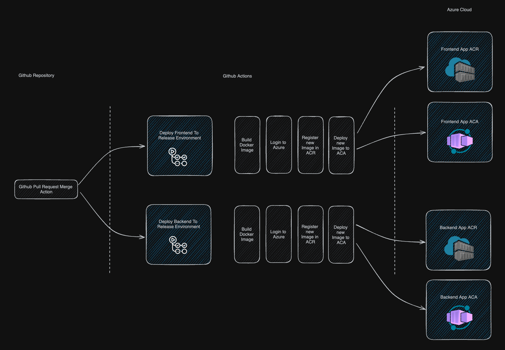
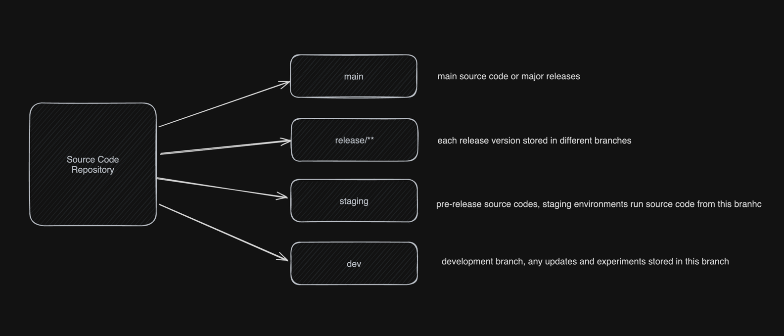

### Introduction

This is example of CI/CD pipeline setup for backend and frontend solution for Azure Container Registry service

### Getting started

#### Requirements

- Basic knowledge of Azure
- Basic knowledge of Github

#### Problem

We have source code in one of our repositories, we need to deploy source code for deployment, pre-release and release scenarios.

#### Solution overviews



- Create necessary branches
- Create cloud resources
- Setup workflows

### Creating necessary branches



These branches must be created 

- main
- release/** - created only when releasing
- staging
- dev

## Create cloud resources

In this example we will create resources in azure cloud. I used Azure CLI because it's faster and only one interface to create all necessary resources

Following resources will be created
- 2 ACR ( Azure Container Registry ), one for backend and one for frontend
- 2 ACA ( Azure Container App ), one for backend and one for frontend
- 2 CAE ( Container App Environment ), one for backend and one for frontend
- 2 LAW ( Log Analytics Workspace ), one for backend and one for frontend
 
### Prepare Azure CLI

- Open Azure CLI
- Create storage account if needed
- Choose bash for terminal

### Create resource group

```bash
az group create --name <rg-name> --location <location> --subscription <subscription-id>
```

In our example it wil be

```bash
az group create --name azure-demo-pipeline --location eastus --subscription 4f88eadf-90ee-4213-ab71-48efbbfa5aa3
```

Explanation :
- create recourse group with name `azure-demo-pipeline` in `eastus` location

### Create service principal

- Create Service Principal ( registered application ) with following command and copy result credentials in json. Those credentials will be used by github actions

```Bash
az ad sp create-for-rbac --name <app-name> --role contributor --scopes /subscriptions/<subscription-id>/resourceGroups/<rg-name> --json-auth --output json
```

In our example it will be 

```Bash
az ad sp create-for-rbac --name github-deploy-action --role contributor --scopes /subscriptions/4f88eadf-90ee-4213-ab71-48efbbfa5aa3/resourceGroups/azure-demo-pipeline --json-auth --output json
```

Explanation : 
- Create service principal with `contributor` role and `github-deploy-action` name
- For subscription `4f88eadf-90ee-4213-ab71-48efbbfa5aa3` and resource group `azure-demo-pipeline`
- Display service principal credentials as JSON, copy that credentials and save somewhere

### Create container registries

```bash
az acr create --resource-group <your-resource-group> --name <acr-name> --sku Basic 
```

In our example it will

```Bash
az acr create --resource-group azure-demo-pipeline --subscription 4f88eadf-90ee-4213-ab71-48efbbfa5aa3 --name azurepipelinebackend --sku Basic

az acr create --resource-group azure-demo-pipeline  --subscription 4f88eadf-90ee-4213-ab71-48efbbfa5aa3 --name azurepipelinefrontend --sku Basic
```

Explanation
- Create ACR within recourse group `azure-demo-pipeline` with name `azurepipelinebackend` with `Basic` plan
- Create ACR within recourse group `azure-demo-pipeline` with name `azurepipelinefrontend` with `Basic` plan

Obtain ACR credentials in 

### Create container app

```Bash
az containerapp up \
  --name <container-name> \
  --resource-group <rg-name> \
  --location <location> \
  --environment <environment-name> \
  --image mcr.microsoft.com/k8se/quickstart:latest \
  --target-port 8080 \
  --ingress 'external' \
  --query configuration.ingress.fqdn
```

In our example it will be

```Bash
az containerapp up \
  --name azure-pipeline-backend-app \
  --resource-group azure-demo-pipeline \
  --location eastus \
  --environment 'azure-pipeline-app-env' \
  --image mcr.microsoft.com/k8se/quickstart:latest \
  --target-port 8080 \
  --ingress 'external' \
  --query configuration.ingress.fqdn
  
az containerapp up \
  --name azure-pipeline-frontend-app \
  --resource-group azure-demo-pipeline \
  --location eastus \
  --environment 'azure-pipeline-app-env' \
  --image mcr.microsoft.com/k8se/quickstart:latest \
  --target-port 8080 \
  --ingress 'external' \
  --query configuration.ingress.fqdn
```

Explanation

- 